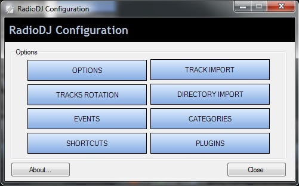
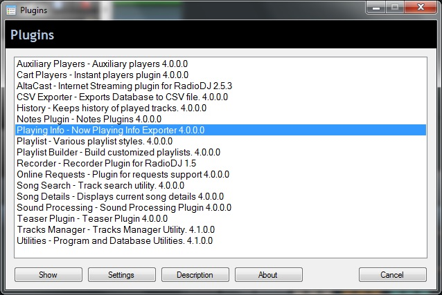

# RadioDJ now playing PHP

This package is a collective effort to create an easier to set up now playing page for [RadioDJ](http://www.radiodj.ro/ "RadioDJ")

Initial code compiled from multiple sources by [Capt_Fuzzy](http://www.radiodj.ro/community/index.php?action=profile;u=9919). Improved and uploaded to GitHub by Valdis.
See [Credits section](#credits) for list of contributors.

Most of this readme can be found in /docs/README.html

# How to use this package with RadioDJ Web Exporter

First off, this package **works**! If you follow these instructions to the letter and place everything properly, this will work "right out of the box".

I am available on the [RadioDJ forums](http://www.radiodj.ro/community/index.php "RadioDJ Forums") under the name [Capt_Fuzzy](http://www.radiodj.ro/community/index.php?action=profile;u=9919) should you get stuck, but I stress again, **if you follow these instructions to the letter**, this will work with little editing on your part.

## Let's get started, shall we?

First, copy the contents of the 'Album-Art' folder from your RadioDJ directory, (usually located at C:\RadioDJ\Album-Art), to a new folder named 'album_art'. Once you have done this, upload your 'album_art' folder to your webserver now, or you can wait and upload all of this at once when we're finished, the choice is yours.  
Make sure the folder is named `album_art`, just the way you see it here!

Unpack the zip file where ever you choose but keep it all together for right now, just so it's easier to find everything.  
The easier you make this on yourself, the easier it will be in general.

> The more you overthink the plumbing, the easier it is to stop up the drain
> 
> _– Montgomery Scott_

Now that we have it unpacked, you should have five (5) files:

1.  config.php
2.  display.php
3.  display.css
4.  radiodj.php
5.  radiodj.txt

To edit these files you should use [Notepad2](http://www.flos-freeware.ch/notepad2.html), [Notepad++](https://notepad-plus-plus.org/) or some other editor that will preserve the format and not mess up character set encoding. I personally use Adobe Dreamweaver, but Frontpage or any other decent HTML editor will work as well.

**WARNING!:** If you mess up the formatting, these files will not work properly!

## Let's start with the `config.php`

**1.** Open `config.php` in your editor and find line 3\. It should look like this:  

<pre>$XPWD = 'RADIODJ_NOW_PLAYING_INFO_PASSWORD';</pre>

Replace `RADIODJ_NOW_PLAYING_INFO_PASSWORD` with same password used in [Now Playing Plugin Web export options](#web-export-plugin-options).

**2.** Next, find line that looks like this:

<pre>$album_art_PATH = 'album_art/';</pre>

Change this to the path of your 'album_art' folder on your web server where you store or upload album art images. This variable is used to check if album art image exists and it has to be the a local path (from PHP standpoint).

For example, if `radiodj.php` is in web server root directory `C:\webserver\public_html\` and album art images are located in `C:\webserver\public_html\album_art\`, `$album_art_PATH` should be set to either `$album_art_PATH = 'album_art/';` (relative to `radiodj.php`) or to absolute path `$album_art_PATH = 'C:/webserver/public_html/album_art/';` absolute.

**Note:** PHP doesn't care which slash is used as directory separator, but backslash (\) is an escape character and should be used with care or escaped by another bachslash (\\).

Next vairable is used in source URL for image tags: ``

<pre>$album_art_URL = 'http://www.YOURRADIOSITE.com/album_art/';</pre>

It should be set to a avalid URL where album art images can be located, but it does not have to be a full URL. You can use either full URL or it could be set to just `'album_art/'`, wich makes it relative to the .php or .html file.

**Note:** To make sure you have the right URL try pasting it in your browser. If you can't open it in your browser then you either have the wrong URL or the directory (folder) is protected and can't be viewed directly. If you see a message like `Error 403 - Access Denies`, try adding an existing image file name to the URL and that image should be loaded. If it doesn't, you're doing something wrong or may have skipped the part where you had to upload/copy album art images to `'album_art'` folder.  
One tip for those of you who host your own webservers, if the domain name in your URL doesn't work, try using the IP:port combination instead. This sometimes works when the domain name doesn't.

**3.** With that done, **SAVE IT!**  

That is really all there is to editing this file to make it work.

This file is configured to display album art for music, news, internet streams (like simulcast shows from online sources or audio files accessed via HTTP protocol on the web) and Variable Duration Files (VDF). If you wish to alter these, here is a list of the track types:

*   0 Music
*   1 Jingle
*   2 Sweeper
*   3 Voiceover
*   4 Commercial
*   5 Internet Stream
*   6 Other
*   7 VDF (Variable Duration File)
*   8 Podcast
*   9 Request ???
*   10 News
*   11 Playlist Event
*   12 FileByDate
*   13 NewestFromFolder
*   14 Teaser

To allow now playing data updates for tracktype of choice, simply uncomment the corresponfing line by removing two slashes (//) at the beggining of line.

Likewise, to disable data updates for specific track type, comment that line out by adding two forward slashes (//) or a hash character (#) at the beginning of the line.

**WARNING!** Again, mind your formatting! If you mess up the syntax, these files will not work properly!

Ok, enough of this, time to move on...

## Now for the `display.php` file

**1.** Open it up in your editor and look for this in line 18:  

``  

**2.** Edit this to reflect the URL of your 'album_art' folder on your webserver.

**3.** You are done with this one, **SAVE IT**!

Remember, if you are hosting your own webserver and the domain name URL doesn't work, try your webserver's IP:port combination.  
This usually will fix the problem. The rest of what's in this file is basically for customizing the look of the output and it is not necessary to edit any of it at this time.

## On to the `display.css`

It is **NOT** vital to edit this file at this time.  
This is a Cascading Style Sheet (.css), all it's for (for those that don't know) is to set the look and feel of the page or site. You can "play" with this one at your leisure...

## And now, the `radiodj.txt` file

If you open this file, you may find it blank.  
There is a reason for this, this is the file that RadioDJ will write to when we set up Web Export in RadioDJ.  
Leave it as is, there is nothing here to edit!  

**Important Note!** For this to work properly, these files **MUST BE UPLOADED TO THE SAME LOCATION AND TO THE SAME DIRECTORY**!!  
If you do not put these files in the same location, you will have to do more editing of them than I think you really want to do, so just keep 'em together, huh?

Take a break here if you wish and review everything to make sure you have edited everything to your liking, then proceed to upload these five (4 excluding radiodj.txt) files to your webserver along with your 'album_art' folder, if you haven't done it already.

## Setting up Web Export in RadioDJ Now playing info plugin

Open RadioDJ and look to the bottom for the Options button. It should be there by default.

<figure>

<figcaption>Main RadioDJ interface</figcaption>

</figure>

<figure>

<figcaption></figcaption>

</figure>

<figure>

<figcaption>Click the Options button and you will see this:</figcaption>

</figure>

<figure>

<figcaption>Click PLUGINS button and you will see this:</figcaption>

</figure>

<figure>

<figcaption>Double-click the highlighted item, <mark>Playing Info - Now Playing Info Exporter 4.0.0.0</mark> to open Now Playing Info options window:</figcaption>

</figure>

<figure id="web-export-plugin-options">

<figcaption>Now, switch to the 'Web Export' tab and you will see this:</figcaption>

</figure>

First, make sure that the 'Custom Data' box is cleared. You won't be able to add or change the password, if the 'Custom Data' field is not empty.  
Enter whatever password that you would like in the 'Password' box and then move to the 'Custom Data' box.  
Copy this line and paste it in the 'Custom Data' box:  
`xpwd=PASSWORD<wbr>&artist=$artist$<wbr>&title=$title$<wbr>&songtype=$track-type$<wbr>&songid=$track_id$<wbr>&album=$album$<wbr>&cover=$album_cover$<wbr>&year=$year$<wbr>&rotation=$rotation_name$<wbr>&listeners=$listeners$<wbr>&duration=$duration$<wbr>&songseconds=$durationSeconds$<wbr>&catid=$subcat-id$<wbr>&genre=$genre-id$<wbr>&station=$station_name$<wbr>&slogan=$station_slogan$<wbr>&requester=$request_username$<wbr>&reqmessage=$request_message

**Note** Value of Password field is used only when Custom Data is not empty and it is always sent as `xpwd` parameter. However, there is a bug in Now Playing Info plugin. Sometimes the plugin will send password as set in password field and combined title in `title` parameter, completely ignoring the custom data field.

You can shorten this if you know what you are doing, but I highly recommend that yo use it as is, simply add the password you entered in the 'Password' box where it says "PASSWORD" in the string and then click the 'Enable' box. Also, make sure that the 'Method' box is set to POST, just like in the above image.

Click 'Save' and you are done.

<figure>

<figcaption>If you did everything correctly and RadioDJ has started playing a track after you saved Web Export settings, you can go to the URL of your 'display.php' file in your browser and you should see something like this:</figcaption>

</figure>

As an example, here is the link to mine: [http://www.wvridgerunners.com/radio/display.php](http://www.wvridgerunners.com/radio/display.php)

And here it is in a webpage: [http://www.wvridgerunners.com/requests.html](http://www.wvridgerunners.com/requests.html)

If the output looks anything like what you see here, you are done!

This tutorial can also be found on my website: [http://www.wvridgerunners.com/readme.html](http://www.wvridgerunners.com/readme.html)

## Credits

I'd like to thank everyone who helped me with code questions and everything that I needed to put this together.

*   **_Brodephat_** - For the initial code base in these files and help putting it together.
*   **_Valdis_** - For code snippets and just generally good ideas.
*   **_AndyDeGroo_** - For code snippets and advice on how to put this together. But mainly _patience_, I'm sure I drove ya nuts there buddy. lol
*   **_Marius_** - For making such an awesome piece of software!

Anyone that I missed, you know who you are.., thank you so much for all each and every one of you have done to contribute to this!

